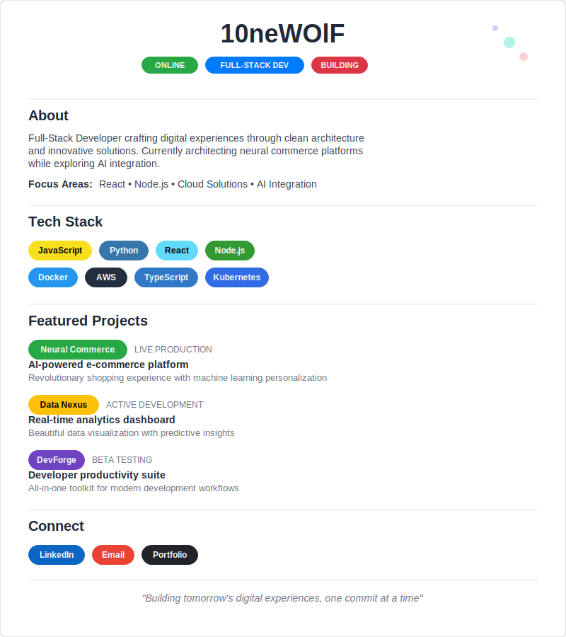

# Hi there, I'm 10neWOlF! 👋

  
<!-- Your Custom Profile Header -->

---

## 📊 GitHub Stats & Activity

  
<!-- GitHub Stats -->

<!-- Most Used Languages -->

<!-- GitHub Streak Stats -->

  

<!-- Activity Graph -->

  

---

## 🏆 GitHub Achievements

  

---

## 💼 Featured Repositories

  
<!-- Replace with your actual repo names -->

---

## 🔥 Recent Activity

<!--START_SECTION:activity-->
<!--END_SECTION:activity-->

---

## 📈 Contribution Graph

  

---

## 🌐 Connect with Me

---

## 💡 Random Dev Quote

---

## 🎯 Current Focus

- 🔭 Working on **Neural Commerce Platform** - AI-powered e-commerce solution
- 🌱 Learning **Advanced AI Integration** and **Cloud Architecture**
- 👯 Looking to collaborate on **Open Source Projects**
- 💬 Ask me about **React, Node.js, Python, and Cloud Solutions**
- ⚡ Fun fact: **Building tomorrow's digital experiences, one commit at a time**

---

### 📊 Profile Views
  

---

  
*"Building tomorrow's digital experiences, one commit at a time"*

⭐️ From [10neWOlF](https://github.com/10newolf)

